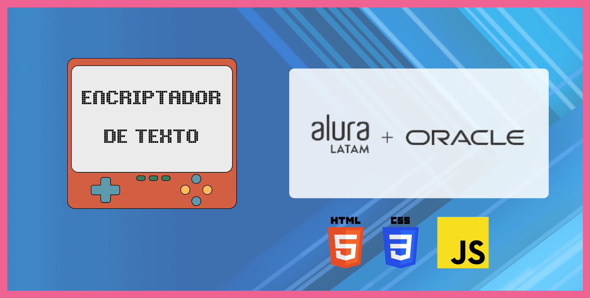

# Encriptador AluraLatam

## Deploy del proyecto ™️
https://encriptadorvanilla.netlify.app/

####  Project by: Nico Rolon ©️
## 🔶 Sobre El proyecto 🔶
Mi nombre es Nicolás Rolón, y este es un proyecto realizado en su totalidad con Javascript, HTML y CSS. Este diseño es full responsive y esta diseñado con la modalidad de Mobile First.
Este encriptador forma parte de un challenge de la formación de Lógica de programación de AluraLatam en conjunto con Oracle. 

##  🚶 Features especiales 🚶
- No permite caracteres especiales.
- No permite comas.
- Permite volver a desencriptar el texto encriptado.
- Cuadro de texto que muestra texto encriptado.
- Alertas y mensajes de error cuando fallan las validaciones. 
